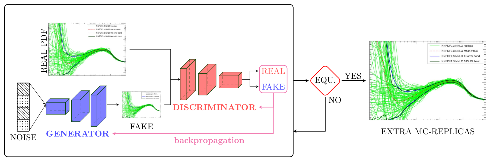
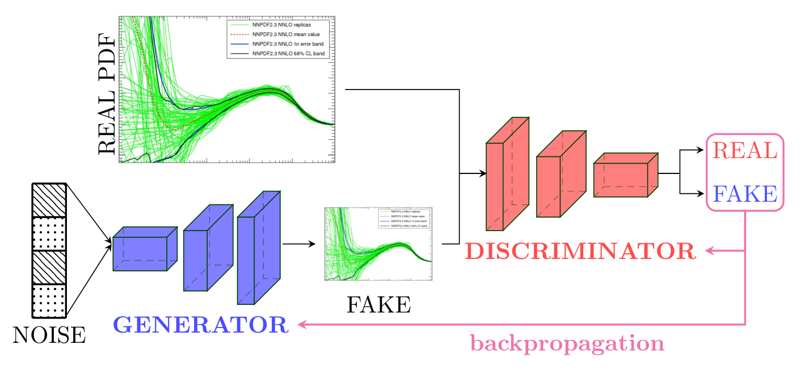
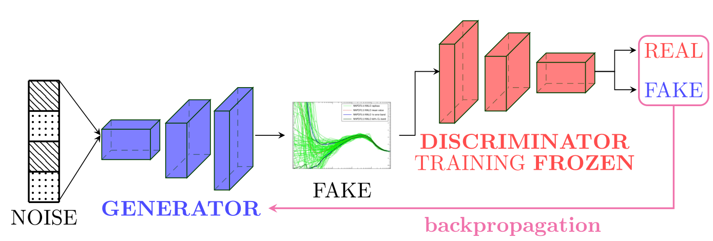
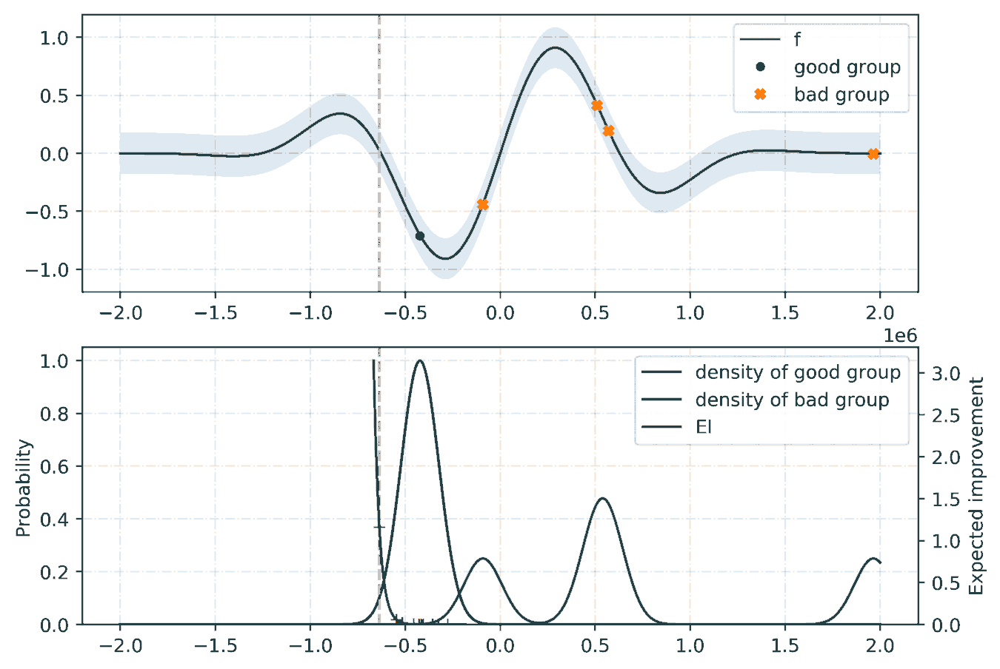

What are GANs?
==============

Generative Adversarial Networks are classes of generative-based learning models that given an input
data with some probability distribution `\mathcal{P}` generate new data following the same probability distribution 
by competing two neural network models: a generative model `\mathcal{G}` (Generator) that tries to capture and 
generate data distribution, and a discriminative model `\mathcal{D}` (Discriminator or Critic) that estimates the 
probability that a sample came from the input data rather than from the Generator. This adversarial 
training allows both models to improve over training to the point that the Generator is becoming very 
good at faking the input data such that the Discriminator can no longer distinguish between generated 
and input data.

The two neural network models, Generator and Discriminator, are trained together. The Generator generates 
a batch of samples that along with the samples from the input datad are provided to the Discriminator and 
classified as real (from the input) or fake (from the generated). The training goes on until equilibrium 
(Nash Equilibrium) is reached.

Why the need of GANs for PDFs?
==============================

Techniques from generative models can be used to improve the efficiency of the PDF compression
methodology. IN the standard approach, the task fo the compressor is to extract samples tha
present small fluctuations and which reproduce best the statistical properties of the original
distribution. It should be therefore possible to use GANs ti generate samples of replucas that
contain less fluctuations and once combined with samles from the prior lead t a more efficient
compressed representation of the full result.

Discriminator Training
======================

The Discriminator model takes as input MC PDF replicas of shape (NB, NF, X) where NB denotes the number of 
replica batches, NF the number of flavors, and X the size of the x-grid. The model then outputs predictions 
as to wether the samples are **real** with (-1) labels or **fake** with (1) labels. In different implemtations 
of GANs, (0) and (1) labels are respectively used to denote the fake and real samples with a Sigmoid as an 
activation function for the output layer. However, using (-1) and (1) as labels with tanh as activation 
function is found to be much more efficient. The information as to whether the Discriminator manages to 
distinguish between real and fake samples is then used to update its weights.

Generator Training
==================

The Generator model takes as input a vector (matrix) of random noise and outputs synthetic MC replicas of shape 
(NB, NF, X). The Generator's outputs are then fetch into the Discriminator. During the training of the Generator, 
it is important that the Discriminator is freezed; otherwise equilibirum might never be reached.

Hyperoptimization
=================

*Hyperoptimization* or *hyper-parameter tuning* refers to the automatic optimizations of the hyper-parameters
of a Machine Learning model. We refer to *hyper-parameters* all the parameters of a model that are not updated
during the training such as the number of layers, the activation functions, and the algorithm used to minimize
the cost function(s). Such optimization (tunning) allows us to search for the best values of hyper-parameters
through an *hyper-parameter space*.

Fréchet Inception Distance (FID)
--------------------------------

An important part of the hyper-parameter tuning is the definition of a metric that assesses the goodness
of the model. In context of GANs (for PDFs), such a quantity must measure the quality of the generated PDF
replicas. To evaluate the performance of the GAN model, we use the **Fréchet Inception Distance (FID)** :cite:`HeuselRUNKH17`.

The Fréchet Inception Distance between a multivariate Gaussian with mean :math:`\mu_{r}` and covariance
:math:`\Sigma_{r}` and a multivariate Gaussian wit mean :math:`\mu_{g}` and covariance :math:`\Sigma_{g}`
(where :math:`r` and :math:`g` resp. denotes samples from real and generated) is given by:

.. math::
   \mathrm{FID} = || \mu_{r} - \mu_{g} ||^2 + \mathrm{Tr} \left( \Sigma_{r} + \Sigma_{g} -  2 \sqrt{\Sigma_{r} \Sigma_{g}} \right)

Thus, the lower the value of the FID is, the closer the generated PDFs are to the priors; if the generated
PDFs are exactly the same as the input MC PDFreplicas, then the value of the FID is zero.

Optimization Algorithm: TPE
---------------------------

For the tunning of the hyper-parameters, we rely on a python library called `hyperopt <https://github.com/hyperopt/hyperopt>`_ with
the *Tree-structured Parzen Estimator (TPE)* :cite:`NIPS2011_4443` as the optimization algorithm. Given a set of hyper-parameters :math:`x` with an
associated quality score :math:`y`, the idea of TPE is to compute a tree of Parzen estimators :math:`P (x | y)` and :math:`P(y)`.
To initialize the algorithm, the TPE starts from a random search. Then, it splits the results into two groups: the best performing ones
and the reset by defining a splitting value :math:`\tilde{y}`. The likelihood probability for being in each of the groups is modeled as:

.. math::
   P(x|y) = \mathcal{L} (x) \quad \text{if} \quad y < \tilde{y}

.. math::
   P(x|y) = \mathcal{G} (x) \quad \text{if} \quad y > \tilde{y}

where the two densities :math:`\mathcal{L}` and :math:`\mathcal{G}` are modeled using kernel density estimators
which are a simple average of the kernels centered on existing data points. :math:`P(y)` is modeled using the fact
that :math:`P(y < \tilde{y}) = 0.75` if :math:`\mathcal{G}` models the upper quartile. Finally, the next set of hyper-parameters
are taken as the maximizer of :math:`\mathcal{L}(x) / \mathcal{G}(x)` :cite:`bissuel_2019` as shown below:

